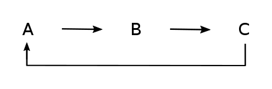

```{r setup, include=FALSE}
knitr::opts_chunk$set(echo = TRUE)
```

This calander door gives you a basic overview about the two major **optimization functions** used in dMod which are **trust()** for single fits and **mstrust()** for multi-start optimization. They will be exemplified with the following ABC toymodel:




```{r, echo=FALSE, message=FALSE}

### This Code defines the ABC toymodel ###

# Load package dMod
library(dMod)

# Define reactions
reactions <- NULL
reactions <- addReaction(reactions, "A_state", "B_state",
                         rate = "k1*A_state",
                         description = "A to B")
reactions <- addReaction(reactions, "B_state", "C_state",
                         rate = "k2*B_state",
                         description = "B to C")
reactions <- addReaction(reactions, "C_state", "A_state",
                         rate = "k3*C_state",
                         description = "C to A")

# Translate into ODE model
ABC_model <- odemodel(reactions, modelname = "ABCmodel")

# Generate prediction function from ODE model
x <- Xs(ABC_model, condition = NULL)

# Define observations
observables <- eqnvec(
  B_obs = "scale*B_state",
  C_obs = "scale*C_state")

# Generate observation function
g <- Y(observables, f = reactions, condition = NULL,
       compile = TRUE, modelname = "obsfn")


# Simuate data
# Define time points for data simulation
timesD <- c(3, 11, 20, 35, 50) #c(0.1, 1, 3, 7, 11, 15, 20, 41) 

# Define parameter values for data simulation
pars <- c(A_state = 0.93,  
          B_state = 0.1,    
          C_state = 0.1,    
          k1 = 0.2,
          k2 = 0.072,
          k3 = 0.1,
          scale = 1e2)

# Generate a prediction
times <- seq(0, 50, .1)
out <- (g*x)(times, pars, conditions = "standard")

datasheet <- subset(wide2long(out), time %in% timesD & name %in% names(observables))
datasheet$sigma <- sqrt(datasheet$value + 1)
datasheet$value <- rnorm(nrow(datasheet), datasheet$value, datasheet$sigma)

data <- as.datalist(datasheet)

# Log-transform parameters for fitting
innerpars <- unique(c(getParameters(ABC_model), getParameters(g)))
trafo <- as.eqnvec(innerpars, names = innerpars) 

p <- P(
  trafo <- repar("x ~ exp(x)", trafo, x = innerpars),
  condition = "standard")

outerpars <- getParameters(p)
parinit <- structure(rep(-1, length(outerpars)), names = outerpars)

# Generate objective function (to be optimized)
obj <- normL2(data, g*x*p) + constraintL2(parinit, sigma = 10)

### End model definition ###

```

#### 1. trust():

- single fit starting the optimization at the parameter values defined in *parinit* (here chosen as -1 for all parameters)
- you can define **borders** via *parupper* and *parlower* to restrict the parameter space  

The following code produces a single fit for the ABC model and plots the fit together with simulated data.

```{r}

myfit <- trust(obj, parinit, rinit = 1, rmax = 10, iterlim = 50, parupper = 5, parlower = -10)
plot((g*x*p)(times, myfit$argument), data)

```


#### 2. mstrust():

- multiple fits (number of fits is specified in *fits*) starting from different parameter values randomly sampled around the values defined in *parinit*. You can adjust the distribution from which values are drawn under *samplefun*, the default is a normal distribution
- you can **parallelize** the fits on several cores of a machine by defining the precise number of cores to use or by using all free cores detected via **detectFreeCores()**
- this function is just a wrapper around the trust function and thus provides all options present in trust(), e.g. you can also use borders

In the following a multi-start optimization with 50 fits is performed 

```{r}

out_mstrust <- mstrust(obj, parinit, rinit = 1, rmax = 10, iterlim = 1000,
                       cores = detectFreeCores(), fits = 50)

fitlist <- as.parframe(out_mstrust)
plotValues(fitlist)

```

You can then analyze the different fits of your optimization run e.g. the bestfit which is in this simple model most often identical with the single fit result from *trust()*:

```{r}
bestfit <- as.parvec(fitlist,1) # check fit No. 1
plot((g*x*p)(times, bestfit), data)
```


