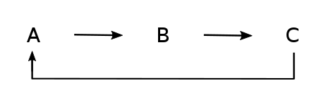

```{r setup, include=FALSE}
knitr::opts_chunk$set(echo = TRUE)
```

```{r, message=FALSE}
library(dMod)
```

Today we will introduce you to the two **plotting** functions **plotValues()** and **plotPars()** you can use to analyze your fitlist obtained from optimization e.g. with *mstrust()*. They will be exemplified with the following ABC toymodel:



```{r}

### This Code defines the ABC toymodel ###

# Define reactions
reactions <- NULL
reactions <- addReaction(reactions, "A_state", "B_state",
                         rate = "k1*A_state",
                         description = "A to B")
reactions <- addReaction(reactions, "B_state", "C_state",
                         rate = "k2*B_state",
                         description = "B to C")
reactions <- addReaction(reactions, "C_state", "A_state",
                         rate = "k3*C_state",
                         description = "C to A")

# Translate into ODE model
ABC_model <- odemodel(reactions, modelname = "ABCmodel")

# Generate prediction function from ODE model
x <- Xs(ABC_model, condition = NULL)

# Define observations
observables <- eqnvec(
  B_obs = "scale*B_state",
  C_obs = "scale*C_state")

# Generate observation function
g <- Y(observables, f = reactions, condition = NULL,
       compile = TRUE, modelname = "obsfn")


# Simuate data
# Define time points for data simulation
timesD <- c(3, 11, 20, 35, 50) #c(0.1, 1, 3, 7, 11, 15, 20, 41) 

# Define parameter values for data simulation
pars <- c(A_state = 0.93,  
          B_state = 0.1,    
          C_state = 0.1,    
          k1 = 0.2,
          k2 = 0.072,
          k3 = 0.1,
          scale = 1e2)

# Generate a prediction
times <- seq(0, 50, .1)
out <- (g*x)(times, pars, conditions = "standard")

datasheet <- subset(wide2long(out), time %in% timesD & name %in% names(observables))
datasheet$sigma <- sqrt(datasheet$value + 1)
datasheet$value <- rnorm(nrow(datasheet), datasheet$value, datasheet$sigma)

data <- as.datalist(datasheet)

# Log-transform parameters for fitting
innerpars <- unique(c(getParameters(ABC_model), getParameters(g)))
trafo <- as.eqnvec(innerpars, names = innerpars) 

p <- P(
  trafo <- repar("x ~ exp(x)", trafo, x = innerpars),
  condition = "standard")

outerpars <- getParameters(p)
parinit <- structure(rep(-1, length(outerpars)), names = outerpars)

# Generate objective function (to be optimized)
obj <- normL2(data, g*x*p) + constraintL2(parinit, sigma = 10)

### End model definition ###

# Perform a multi-start optimization
out_mstrust <- mstrust(obj, parinit, rinit = 1, rmax = 10, iterlim = 500,
                       cores = detectFreeCores(), fits = 100)

fitlist <- as.parframe(out_mstrust)

```


#### Plotting objective values of a multi-start optimization:

In order to displays the ordered **objective values** of your fitlist you can use the function **plotValues()**. 

```{r}
plotValues(fitlist, tol = 1)
```

Dashed lines indicate a jump to the next local optimum and display the first fitting index per optimum respectively. The maximal allowed difference between neighboring objective values to be matched to the same optimum is defined in *tol*.

To zoom in you can simply make this plot for a subset of your fitlist:

```{r}
plotValues(fitlist[1:20])
```


#### Plotting parameter values:

The function **plotPars()** displays the **parameter values** belonging to the different optima of your multi-start optimization run. Values of each optimum are displayed in another color. Again, *tol* defines the maximal allowed difference between neighboring objective values to be recognized as one.

```{r}
plotPars(fitlist, tol = 0.1)
```

To analyze parameter values of specific fits, e.g. the best one, just subset your fitlist:

```{r}
plotPars(fitlist[1])
```


**Note:** Both functions can also be used with the **dMod.frame** by defining the additional argument *hypothesis*.